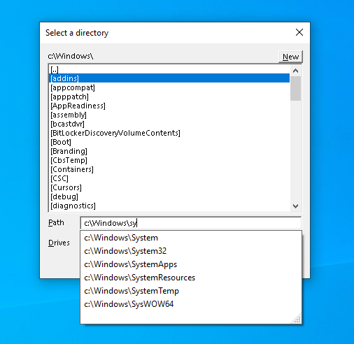

# DIRDLG
Self-contained custom directory selection dialog C++ class for Win32 applications.

### Why
I'm not happy with SHBrowseForFolder and the stock file dialogs, as I don't like click/expand trees or and the fact that the inital directory 
parameter sometimes gets ignored.

## Features
Not much to report, but:
- header-only library with no resource/.rc files dependency
- Path autocompletion
- Fast keyboard naviagtion with, including these shortcuts:
   - \                 = go to root dir
   - &lt;backspace&gt; = go to parent dir
   - F1                = volume select


## Example
```
   #include "dirdlg.h"
   #include <iostream>
   ...
   auto s = DIRDLG{}.get_dir(".");
   if (s) {
     std::cout << s << " selected\n";
   }
````

## License
MIT [License](LICENSE)

## Feedback
Bugs/Suggestions/Comments/Feedback to:
* Email: [feedback@THLG.NL](mailto:feedback@THLG.NL)

#### Finally
Thanks for visting!

